# Honest Auction House (ZKP Verifiable Sealed-Bid)

A Zero-Knowledge Proof (ZKP) based auction system where users submit sealed bids without revealing the amount to the server or the public until the bidding time ends. This guarantees **bid privacy**, **auction integrity**, and protection against **front-running**, using `circom` and `snarkjs`.

---

## 🛠 Tech Stack

- **Frontend:** React (Vite), TypeScript, `snarkjs` (Browser-side Prover)
- **Backend:** Node.js, Express, `snarkjs` (Server-side Verifier)
- **Database:** PostgreSQL (via Prisma ORM)
- **Cryptography:** Circom (Circuits), Groth16 Proofs, Poseidon Hash
- **Infrastructure:** Render (Backend/DB) + Vercel (Frontend)

### Technical Specifications

- **ZKP Circuit:** Groth16 over the `bn128` curve.
- **Security:** 64-bit range checks via `Num2Bits(64)` to prevent finite field wrapping attacks.
- **Hashing:** Poseidon Hash (ZK-optimized).
- **State Engine:** Hybrid "Lazy + Proactive" system. Phase transitions are triggered by user interaction (`GET /auctions`) or a 60-second server interval.
- **⚠️ Critical Timing Notice**: The Reveal Phase
  The auction duration is split:
- **Bidding Phase:** 90% of total time.
- **Reveal Phase:** Final 10% of total time.

> [!WARNING]
> If setting short auction durations (e.g., 5 minutes), the reveal window is only 30 seconds. Ensure durations allow sufficient time for users to submit their secrets.

---

## 🌟 Key Features

- **Privacy First:** Bids are submitted as cryptographic commitments. The server _never_ sees the bid amount during the bidding phase.
- **Verifiable Integrity:** Uses `Circom` and `Groth16` proofs to cryptographically verify bid validity without revealing data.
- **Security Hardened:**
  - **Replay Attack Protection:** Proofs are bound to specific Auction IDs.
  - **Negative Bid Prevention:** 64-bit range checks prevent integer overflow attacks.
- **User Experience:**
  - Automatic local backups of bid secrets.
  - One-click "Reveal" functionality using `localStorage`.

---

---

## ⚠️ Production Considerations & Trade-offs

While this project demonstrates a functional ZKP architecture, a production-grade deployment would require addressing the following:

### 1. The "Rational Irrationality" Problem (Incentives)

**Issue:** In a sealed-bid auction, losing bidders have no economic incentive to perform the "Reveal" action (which costs gas/time) once they realize they cannot win.
**Production Fix:** Implement a **Collateral/Slashing mechanism**. Users must deposit funds to place a sealed bid. If they fail to reveal their bid during the disclosure phase, their deposit is slashed (forfeited).

### 2. Secret Management & XSS

**Issue:** This demo stores bid secrets in the browser's `localStorage` for UX convenience. In a real scenario, this is vulnerable to Cross-Site Scripting (XSS) attacks.
**Production Fix:** Secrets should never be stored in plaintext accessible by JS. A production app would use a **Browser Extension Wallet** or **Encrypted Storage** where the decryption key is held solely by the user (e.g., derived from a signature).

### 3. The Trusted Setup (MPC)

**Issue:** The cryptographic keys (`.zkey`) for this project were generated locally. Theoretically, the developer (me) could possess the "toxic waste" entropy to forge proofs.
**Production Fix:** A **Multi-Party Computation (MPC) Ceremony** (like the ones used by Zcash or Tornado Cash) is required. This ensures that as long as one participant is honest, the system is secure.

---

## 📂 Project Structure

```text
honest-auction-house/
├── circuits/               # ZKP Definition
│   ├── bid_check.circom    # Main Circuit
│   └── simple_hash.circom  # Utility
├── client/                 # Frontend
│   ├── public/             # Contains .wasm and .zkey files (served at root '/' in deployment)
│   │   ├── bid_check.wasm
│   │   └── bid_check_final.zkey
│   ├── src/
│   │   ├── lib/snark-utils.ts # Proof generation logic
│   │   └── components/     # UI Components
├── server/                 # Backend
│   ├── src/
│   │   ├── utils/verifier.ts # Proof verification logic
│   │   ├── verification_key.json # Required for verifier
│   │   └── index.ts        # API Routes
│   └── prisma/             # DB Schema
```

---

## High-Level Architecture

The system operates on a "Thick Client" model regarding cryptography. The browser is responsible for generating cryptographic proofs, while the server acts as a coordinator and verifier.

```mermaid
graph TD
    subgraph Client [Browser / React App]
        UI[User Interface]
        LStore[localStorage (Secrets)]
        WASM[Circuit WASM]
        ZKey[Proving Key (.zkey)]
        Snark[SnarkJS Prover]

        UI --> Snark
        LStore <--> UI
        WASM --> Snark
        ZKey --> Snark
    end

    subgraph Backend [Node.js Server]
        API[Express API]
        Verifier[ZK Verifier]
        VKey[Verification Key (.json)]
        Auth[JWT Auth & BCrypt]

        API --> Verifier
        API --> Auth
        VKey --> Verifier
    end

    subgraph Persistence [Database]
        DB[(PostgreSQL)]
    end

    Snark --"POST /bid (Proof + Commitment)"--> API
    UI --"POST /reveal (Secret + Amount)"--> API
    API --"Read/Write"--> DB
```

---

## Data Model (Entity-Relationship)

The database schema is designed to separate the User identity from the Bid content until the reveal phase.

```erDiagram
    USER ||--o{ AUCTION : "creates (seller)"
    USER ||--o{ BID : "places"
    USER ||--o{ AUCTION : "wins"

    USER {
        int id PK
        string username
        string password "Hashed"
        enum role "USER | ADMIN"
    }

    AUCTION {
        int id PK
        string title
        int durationMinutes // Total time (Bidding + Reveal)
        datetime biddingEndsAt // Explicit cutoff for Phase 1
        datetime createdAt // Used for lazy phase calculation
        enum status "OPEN | REVEAL | CLOSED"
        int winningAmount "Nullable"
    }

    BID {
        int id PK
        string commitment "Unique Hash"
        int amount "NULL until reveal"
        string secret "NULL until reveal"
        datetime createdAt
```

Key Observation: The `BID` table stores the `amount` and `secret` as `NULL` during the `OPEN` phase. The `commitment` (hash) is the only data point stored initially.

---

## 🔄 How It Works: The Commit-Reveal Scheme

### Phase 1: The Bidding (Commit)

1.  **User** enters an amount (e.g., 5 ETH) and a secret key.
2.  **Browser** generates a Zero-Knowledge Proof locally using `bid_check.wasm`.
3.  **Server** verifies the proof and stores the **Commitment Hash**.
    - _The server does NOT know the amount or the secret._
4.  **Browser** downloads a backup `.txt` file containing the secret.

### Phase 2: The Reveal (Verify)

1.  Once the auction timer ends, the phase switches to **REVEAL**.
2.  **User** clicks "Reveal My Bid". The app loads the secret from `localStorage`.
3.  **Server** hashes the revealed `amount + secret`.
4.  If `Hash(revealed) == Stored_Commitment`, the bid is accepted as valid.

## 🚀 How to Run Locally

### Prerequisites

- [Node.js](https://nodejs.org/) (v18+)
- [Docker Desktop](https://www.docker.com/products/docker-desktop/) (Recommended for Database)
- OR a local PostgreSQL installation

### 1. Start the Database

If using Docker, run this in the root folder:

```bash
docker-compose up -d
```

### 2. Setup Backend (Server)

```bash
cd server

# 1. Install Dependencies
npm install

# 2. Setup Environment Variables
# Create a .env file and paste the contents from .env.example
# Ensure DATABASE_URL matches your local/Docker DB credentials and your ADMIN_SECRET set to a secure string.

# 3. Initialize Database Schema
npx prisma db push

# 4. Verification Key Setup
# Ensure `verification_key.json` is present in `server/src/`
# (This file is generated from the circuits folder)

# 5. Start Server
npm run dev
```

Server runs on: http://localhost:3000

### 3. Setup Frontend (Client)

```bash
cd client

# 1. Install Dependencies
npm install

# 2. Move ZKP Artifacts (One-time setup)
# For the app to verify proofs in the browser, it needs these files.
# If they are missing, check the 'circuits' folder or compile them manually.
# Ensure `bid_check.wasm` and `bid_check_final.zkey` are in `client/public/`

# 3. Start React App
npm run dev
```

#### App runs on: http://localhost:5173

### 4. Setup Admin (Optional)

To access the Admin Dashboard:

1. Go to the Register page.

2. Toggle the registration form to include the **Admin Secret** field.

3. Enter the `ADMIN_SECRET` (Found in `.env`).

4. This grants access to the `/admin` route to view the global bid ledger and reset the system.

### 5. ZKP Circuits (Regeneration)

If you modify `.circom` files, you must recompile. Note: I use the Windows binary for `circom`.

```bash
cd circuits

# 1. Compile Circuit (Generates WASM)
circom bid_check.circom --r1cs --wasm --sym

# 2. Generate Reference ZKey (Phase 2)
snarkjs groth16 setup bid_check.r1cs pot12_final.ptau bid_check_0000.zkey

# 3. Contribute Randomness
snarkjs zkey contribute bid_check_0000.zkey bid_check_final.zkey --name="YourName" -v

# 4. Export Verification Key
snarkjs zkey export verificationkey bid_check_final.zkey verification_key.json

# 5. Move Artifacts
# Client needs these to generate proofs:
mv bid_check.wasm ../client/public/
mv bid_check_final.zkey ../client/public/

# Server needs this to verify proofs:
mv verification_key.json ../server/src/
```

### 6. 🚀 Optional Integrated Build & Run

The project is configured as a workspace. You can build both the frontend and backend into a single deployable unit.

1. **Full Production Build:**

   ```bash
   npm run build # Runs build:full in the server directory
   ```

   This script compiles the React frontend, moves it to `server/dist/public`, and compiles the TypeScript backend.

2. **Run Integrated Server:**

   ```bash
   npm start
   ```

   The app will be accessible at `http://localhost:3000`.

#### 🌐 Production Connectivity

- **CORS:** The backend `origin` must match your Vercel URL.
- **Environment:** Ensure your `.env` (Backend) and Vercel/Vite environment variables are configured:
  | Variable | Description | Location |
  | :--- | :--- | :--- |
  | `DATABASE_URL` | PostgreSQL connection string | Server |
  | `ADMIN_SECRET` | Required for admin registration | Server |
  | `VITE_API_URL` | URL of your deployed Backend | Client |
  | `RP_ID` | Passkey Relying Party ID (default: localhost) | Server |

---

## 📊 System Diagrams

### Sequence Diagram: The ZKP Bid Lifecycle

```mermaid
sequenceDiagram
    autonumber
    actor User
    participant Client as 💻 Browser (Client)
    participant Server as 🛡️ Server (Backend)
    participant DB as 💾 Database

    Note over User, DB: 🛑 PHASE 1: COMMIT (Sealed Bid)

    User->>Client: Enters Amount (10 ETH) + Secret (12345)

    rect rgb(240, 248, 255)
        Note right of Client: 🔒 Privacy happens here
        Client->>Client: Fetch Auction ID (e.g., 99)
        Client->>Client: Calculate Hash(10, 12345, 99) ➔ "0xABC..."
        Client->>Client: Generate ZK Proof<br/>(Private: 10, 12345 | Public: "0xABC...", 99)
    end

    Client->>Server: POST /bid<br/>{ proof, commitment: "0xABC...", auctionId: 99 }

    Server->>Server: Verify Proof & Check AuctionID Binding
    alt Proof Invalid / Wrong Auction
        Server-->>Client: ❌ Error: Integrity Check or Replay Attack Failed
    else Proof Valid
        Server->>DB: INSERT Bid (Commitment="0xABC...", Amount=NULL)
        Server-->>Client: ✅ Bid Placed (Values Hidden)
    end

    Note over User, DB: ⏳ TIME PASSES ... AUCTION ENDS

    Note over User, DB: 🔓 PHASE 2: REVEAL

    User->>Client: Clicks "Reveal" (Loads saved Secret)
    Client->>Server: POST /bid/reveal<br/>{ amount: 10, secret: 12345, auctionId: 99 }

    Server->>DB: GET Bid by UserID
    DB-->>Server: Returns stored Commitment "0xABC..."

    rect rgb(255, 240, 245)
        Note left of Server: 🔍 Verification logic
        Server->>Server: Re-calculate Hash(10, 12345, 99)
        Server->>Server: Check if Calculated Hash == Stored "0xABC..."
    end

    alt Hash Mismatch
        Server-->>Client: ❌ Cheating Detected!
    else Hash Matches
        Server->>DB: UPDATE Bid SET amount=10, secret="12345"
        Server-->>Client: ✅ Bid Revealed Successfully
    end
```



### State Diagram: Auction Status Flow


---

🛡️ Security

### ✅ Verified Security Features

The following logic has been confirmed secure:

1.  **Replay Attack Protection:** The circuit includes `auctionId` as a public input, and the server strictly validates `publicSignals[0] === auctionId` before accepting a proof.
2.  **Negative Bid Prevention:** The circuit utilizes `Num2Bits(64)` to prevent finite field wrapping attacks (e.g., submitting `-1` to represent a large positive integer).
3.  **Data Minimization:** The server database stores `amount` and `secret` as `NULL` until the user explicitly authorizes a reveal.

### 🚨 Known Vulnerabilities & Risks

_See [docs/SECURITY_AND_FUTURE_FIXES.md](docs/SECURITY_AUDIT.md) for the full report._

1.  **Secrets in `localStorage` (Critical):** The app currently stores bid secrets in `localStorage`. This is vulnerable to XSS attacks.
    **Future Fix:** Use `HttpOnly` cookies or non-persistent session storage.
2.  **Lack of Rate Limiting (High):** The `/bid` endpoint verifies ZK proofs (computationally expensive). Without rate limiting, this is a DoS vector.
3.  **"Rational Irrationality" (Protocol):** Losing bidders have no economic incentive to reveal their bids.
    **Future Fix:** Implement a deposit/slashing mechanism.

---

## 📚 Documentation

- **[Security Audit](docs/SECURITY_AUDIT.md):** Detailed breakdown of vulnerabilities and fixes.
- **[System Flows](docs/SYSTEM_FLOWS.md):** Architecture and user journeys.
- **[ZKP & Circom Guide](docs/CIRCOM_GUIDE.md):** Cryptography deep dive.
