# Honest Auction House (ZKP Verifiable Sealed-Bid)

A Zero-Knowledge Proof (ZKP) based auction system where users can submit sealed bids without revealing the amount to the server or public until the auction closes. This project guarantees bid privacy and auction integrity using `circom` and `snarkjs`.

---

## 🛠 Tech Stack

- [cite_start]**Frontend:** React (Vite) + TypeScript [cite: 23, 24]
- [cite_start]**Backend:** Node.js + Express [cite: 54]
- [cite_start]**Database:** PostgreSQL (via Prisma ORM) [cite: 55, 56]
- [cite_start]**ZKP Engine:** Circom (Circuits) + SnarkJS (Proofs) [cite: 8, 9]
- **Infrastructure:** Render (Backend/DB) + Vercel (Frontend)

---

## 📂 Project Structure

```text
honest-auction-house/
├── circuits/               # ZKP Circuits (.circom) & Compilation Artifacts
├── client/                 # React Frontend (Vite)
├── server/                 # Express Backend & Prisma ORM
├── docker-compose.yml      # (Optional) Local DB setup
└── README.md               # Project Documentation
```

---

## 📅 Project Progress Log

### ✅ Phase 1: Infrastructure & Setup (Completed)

- **Monorepo Initialization:** Established directory structure for `client`, `server`, and `circuits`.
- **Dependencies Installed:** Configured `package.json` for root, client (React/Vite), and server (Express/Prisma).
- **Git Integration:** Set up `.gitignore` to handle node_modules, build artifacts, and sensitive `.env` files.
- **Deployment:**
  - Frontend successfully deployed to **Vercel**.
  - Backend successfully deployed to **Render**.
- PostgreSQL database instance provisioned and connected on **Render**.

### ✅ Phase 2: Database & Backend Core (Completed)

- **Schema Design:** Defined Prisma models for `User`, `Auction`, and `Bid`.
- **Database Sync:** Ran `prisma db push` and `prisma generate` to create the SQL tables.
- **API Implementation:**
  - Initialized Express server with CORS and JSON parsing.
  - Implemented `POST /register`, `POST /login`, and `POST /auctions`.
- **Connected:** `PrismaClient` to the active PostgreSQL database.

### ✅ Phase 3: ZKP Circuit Engine & Verification (Completed)

- **Circuit Logic:**
  - Created `circuits/bid_check.circom`: Validates `Hash(amount, secret) == commitment`.
  - Created `circuits/simple_hash.circom`: Utility for generating hashes.
- **Trusted Setup (Ceremony):**
  - Generated Powers of Tau (Phase 1) and ZKey artifacts (Phase 2).
  - Exported `verification_key.json` for server-side checks.
- **Client Integration:**
  - Implemented `snark-utils.ts` using `snarkjs` and `circomlibjs`.
  - **Polyfilled Node.js globals** (Buffer) to allow ZK proof generation in Vite/Browser.
- **Server Verification:**
  - Implemented `utils/verifier.ts` to cryptographically verify proofs on the backend.
  - Added `POST /bid` endpoint that accepts a proof, verifies it, and stores the commitment.

### ✅ Phase 4: Full Auction Lifecycle (Completed)

- **Reveal Phase:** Implemented `POST /bid/reveal` logic to cryptographically verify `Hash(amount, secret) == stored_commitment`.
- **Frontend Integration:**
  - **Dynamic Auth:** Replaced hardcoded IDs with a working Login/Register flow.
  - **Auction Dashboard:** Real-time fetching of active auctions via `GET /auctions`.
  - **Action States:** UI automatically toggles between "Place Sealed Bid" and "Reveal Bid" based on auction status.
- **Deployment & Stability:**
  - Resolved TypeScript definitions and ESM import issues for `circomlibjs` on Node.js.
  - Fixed React Hook dependency cycles and linting errors for production builds.
  - Configured automated database schema syncing (`prisma db push`) for Render.

### ✅ Phase 5: Production Hardening & UX Polish (Completed)

- **Security:** - Replaced plaintext password storage with `bcrypt` hashing for `POST /register` and `POST /login`.
- **UX Automation:** - Implemented `setInterval` polling in React to automatically refresh the auction list.
  - Added logic to auto-trigger the "Lazy Update" on the server, ensuring auctions transition from `OPEN` to `REVEAL` without manual refresh.
- **Production Config:** - Configured strict CORS settings to allow secure communication between Vercel (Frontend) and Render (Backend).

---

---

## 🚀 How to Run Locally

Follow these steps to get the full system running on your machine.

### Prerequisites

- [Node.js](https://nodejs.org/) (v18+)
- [Docker Desktop](https://www.docker.com/products/docker-desktop/) (Recommended for Database)
- OR a local PostgreSQL installation

### 1. Start the Database

If using Docker, run this in the root folder:

```bash
docker-compose up -d
```

This starts a Postgres DB on port 5432 with user admin and password password123.

### 2. Setup Backend (Server)

```bash
cd server

# 1. Install Dependencies
npm install

# 2. Setup Environment Variables
# Create a .env file and paste the contents from .env.example
# Ensure DATABASE_URL matches your local DB credentials.

# 3. Initialize Database Schema
npx prisma db push

# 4. Start Server
npm run dev
```

Server runs on: http://localhost:3000

### 3. Setup Frontend (Client)

```bash
cd client

# 1. Install Dependencies
npm install

# 2. Move ZKP Artifacts (One-time setup)
# For the app to verify proofs in the browser, it needs these files.
# If they are missing, check the 'circuits' folder or compile them manually.
# Ensure `bid_check.wasm` and `bid_check_final.zkey` are in `client/public/`

# 3. Start React App
npm run dev
```

App runs on: http://localhost:5173

### 4. Code Adjustments for Hybrid Mode

Ensure your code gracefully handles both environments.

**File:** `server/src/index.ts`
Your CORS setup currently relies on an env var. Make sure it defaults to localhost if the env var is missing.

```typescript
app.use(
  cors({
    origin: process.env.FRONTEND_URL || "http://localhost:5173", // Default to Vite's local port
    methods: ["GET", "POST"],
    credentials: true,
  }),
);
```

File: client/src/App.tsx Ensure the API URL defaults to localhost if the Vite env var isn't set.

```typescript
// If VITE_API_URL is not set in .env, it defaults to localhost:3000
const API_URL = import.meta.env.VITE_API_URL || "http://localhost:3000";
```

### 5. ZKP Circuits (Regeneration)

If you modify `.circom` files, you must recompile. Note: We are using the Windows binary for `circom`.

```bash
cd circuits

# 1. Compile Circuit (Generates WASM)
circom bid_check.circom --r1cs --wasm --sym

# 2. Generate Reference ZKey (Phase 2)
snarkjs groth16 setup bid_check.r1cs pot12_final.ptau bid_check_0000.zkey

# 3. Contribute Randomness
snarkjs zkey contribute bid_check_0000.zkey bid_check_final.zkey --name="YourName" -v

# 4. Export Verification Key
snarkjs zkey export verificationkey bid_check_final.zkey verification_key.json
```

### 6. Final Check: The "Fresh Clone" Test

To guarantee it works for others:

Push all changes (including docker-compose.yml and .env.example) to GitHub.

Go to a new folder on your computer.

Run git clone <your-repo-url>.

Follow your own README steps exactly.

## If you hit a snag (e.g., "Table not found"), add the missing step (e.g., npx prisma db push) to the README.

```mermaid
sequenceDiagram
    autonumber
    actor User
    participant Client as 💻 Browser (Client)
    participant Server as 🛡️ Server (Backend)
    participant DB as 💾 Database

    Note over User, DB: 🛑 PHASE 1: COMMIT (Sealed Bid)

    User->>Client: Enters Amount (10 ETH) + Secret (12345)

    rect rgb(240, 248, 255)
        Note right of Client: 🔒 Privacy happens here
        Client->>Client: Calculate Hash(10, 12345) ➔ "0xABC..."
        Client->>Client: Generate ZK Proof<br/>(Private: 10, 12345 | Public: "0xABC...")
    end

    Client->>Server: POST /bid<br/>{ proof, commitment: "0xABC..." }

    Server->>Server: Verify Proof using Verification Key
    alt Proof Invalid
        Server-->>Client: ❌ Error: Integrity Check Failed
    else Proof Valid
        Server->>DB: INSERT Bid (Commitment="0xABC...", Amount=NULL)
        Server-->>Client: ✅ Bid Placed (Values Hidden)
    end

    Note over User, DB: ⏳ TIME PASSES ... AUCTION ENDS

    Note over User, DB: 🔓 PHASE 2: REVEAL

    User->>Client: Clicks "Reveal" (Loads saved Secret)
    Client->>Server: POST /bid/reveal<br/>{ amount: 10, secret: 12345 }

    Server->>DB: GET Bid by UserID
    DB-->>Server: Returns stored Commitment "0xABC..."

    rect rgb(255, 240, 245)
        Note left of Server: 🔍 Verification logic
        Server->>Server: Re-calculate Hash(10, 12345)
        Server->>Server: Check if Calculated Hash == Stored "0xABC..."
    end

    alt Hash Mismatch
        Server-->>Client: ❌ Cheating Detected!
    else Hash Matches
        Server->>DB: UPDATE Bid SET amount=10, secret="12345"
        Server-->>Client: ✅ Bid Revealed Successfully
    end
```



.circom files ( require local recompilation).

```

```
