# Honest Auction House (ZKP Verifiable Sealed-Bid)

A Zero-Knowledge Proof (ZKP) based auction system where users submit sealed bids without revealing the amount to the server or the public until the auction closes. This guarantees **bid privacy**, **auction integrity**, and protection against **front-running**, using `circom` and `snarkjs`.

---

## 🛠 Tech Stack

- **Frontend:** React (Vite), TypeScript, `snarkjs` (Browser-side Prover)
- **Backend:** Node.js, Express, `snarkjs` (Server-side Verifier)
- **Database:** PostgreSQL (via Prisma ORM)
- **Cryptography:** Circom (Circuits), Groth16 Proofs, Poseidon Hash
- **Infrastructure:** Render (Backend/DB) + Vercel (Frontend)

---

## 🌟 Key Features

- **Privacy First:** Bids are submitted as cryptographic commitments. The server _never_ sees the bid amount during the bidding phase.
- **Verifiable Integrity:** Uses `Circom` and `Groth16` proofs to cryptographically verify bid validity without revealing data.
- **Security Hardened:**
  - **Replay Attack Protection:** Proofs are bound to specific Auction IDs.
  - **Negative Bid Prevention:** 64-bit range checks prevent integer overflow attacks.
- **User Experience:**
  - Automatic local backups of bid secrets.
  - One-click "Reveal" functionality using `localStorage`.

---

## 📂 Project Structure

```text
honest-auction-house/
├── circuits/               # ZKP Definition
│   ├── bid_check.circom    # Main Circuit
│   └── simple_hash.circom  # Utility
├── client/                 # Frontend
│   ├── public/             # Contains .wasm and .zkey files
│   ├── src/
│   │   ├── lib/snark-utils.ts # Proof generation logic
│   │   └── components/     # UI Components
├── server/                 # Backend
│   ├── src/
│   │   ├── utils/verifier.ts # Proof verification logic
│   │   ├── verification_key.json # Required for verifier
│   │   └── index.ts        # API Routes
│   └── prisma/             # DB Schema
```

---

## High-Level Architecture

The system operates on a "Thick Client" model regarding cryptography. The browser is responsible for generating cryptographic proofs, while the server acts as a coordinator and verifier.

```mermaid
graph TD
    subgraph Client [Browser / React App]
        UI[User Interface]
        LStore[localStorage (Secrets)]
        WASM[Circuit WASM]
        ZKey[Proving Key (.zkey)]
        Snark[SnarkJS Prover]

        UI --> Snark
        LStore <--> UI
        WASM --> Snark
        ZKey --> Snark
    end

    subgraph Backend [Node.js Server]
        API[Express API]
        Verifier[ZK Verifier]
        VKey[Verification Key (.json)]
        Auth[JWT Auth & BCrypt]

        API --> Verifier
        API --> Auth
        VKey --> Verifier
    end

    subgraph Persistence [Database]
        DB[(PostgreSQL)]
    end

    Snark --"POST /bid (Proof + Commitment)"--> API
    UI --"POST /reveal (Secret + Amount)"--> API
    API --"Read/Write"--> DB
```

---

## Data Model (Entity-Relationship)

The database schema is designed to separate the User identity from the Bid content until the reveal phase.

```erDiagram
    USER ||--o{ AUCTION : "creates (seller)"
    USER ||--o{ BID : "places"
    USER ||--o{ AUCTION : "wins"

    USER {
        int id PK
        string username
        string password "Hashed"
        enum role "USER | ADMIN"
    }

    AUCTION {
        int id PK
        string title
        int durationMinutes
        datetime biddingEndsAt
        enum status "OPEN | REVEAL | CLOSED"
        int winningAmount "Nullable"
    }

    BID {
        int id PK
        string commitment "Unique Hash"
        int amount "NULL until reveal"
        string secret "NULL until reveal"
        datetime createdAt
```

Key Observation: The `BID` table stores the `amount` and `secret` as `NULL` during the `OPEN` phase. The `commitment` (hash) is the only data point stored initially.

---

## 🔄 How It Works: The Commit-Reveal Scheme

### Phase 1: The Bidding (Commit)

1.  **User** enters an amount (e.g., 5 ETH) and a secret key.
2.  **Browser** generates a Zero-Knowledge Proof locally using `bid_check.wasm`.
3.  **Server** verifies the proof and stores the **Commitment Hash**.
    - _The server does NOT know the amount or the secret._
4.  **Browser** downloads a backup `.txt` file containing the secret.

### Phase 2: The Reveal (Verify)

1.  Once the auction timer ends, the phase switches to **REVEAL**.
2.  **User** clicks "Reveal My Bid". The app loads the secret from `localStorage`.
3.  **Server** hashes the revealed `amount + secret`.
4.  If `Hash(revealed) == Stored_Commitment`, the bid is accepted as valid.

## 📅 Project Progress Log

### ✅ Phase 1: Infrastructure & Setup (Completed)

- **Monorepo Initialization:** Established directory structure for `client`, `server`, and `circuits`.
- **Dependencies Installed:** Configured `package.json` for root, client (React/Vite), and server (Express/Prisma).
- **Git Integration:** Set up `.gitignore` to handle node_modules, build artifacts, and sensitive `.env` files.
- **Deployment:**
  - Frontend successfully deployed to **Vercel**.
  - Backend successfully deployed to **Render**.
- PostgreSQL database instance provisioned and connected on **Render**.

### ✅ Phase 2: Database & Backend Core (Completed)

- **Schema Design:** Defined Prisma models for `User`, `Auction`, and `Bid`.
- **Database Sync:** Ran `prisma db push` and `prisma generate` to create the SQL tables.
- **API Implementation:**
  - Initialized Express server with CORS and JSON parsing.
  - Implemented `POST /register`, `POST /login`, and `POST /auctions`.
- **Connected:** `PrismaClient` to the active PostgreSQL database.

### ✅ Phase 3: ZKP Circuit Engine & Verification (Completed)

- **Circuit Logic:**
  - Created `circuits/bid_check.circom`: Validates `Hash(amount, secret) == commitment`.
  - Created `circuits/simple_hash.circom`: Utility for generating hashes.
- **Trusted Setup (Ceremony):**
  - Generated Powers of Tau (Phase 1) and ZKey artifacts (Phase 2).
  - Exported `verification_key.json` for server-side checks.
- **Client Integration:**
  - Implemented `snark-utils.ts` using `snarkjs` and `circomlibjs`.
  - **Polyfilled Node.js globals** (Buffer) to allow ZK proof generation in Vite/Browser.
- **Server Verification:**
  - Implemented `utils/verifier.ts` to cryptographically verify proofs on the backend.
  - Added `POST /bid` endpoint that accepts a proof, verifies it, and stores the commitment.

### ✅ Phase 4: Full Auction Lifecycle (Completed)

- **Reveal Phase:** Implemented `POST /bid/reveal` logic to cryptographically verify `Hash(amount, secret) == stored_commitment`.
- **Frontend Integration:**
  - **Dynamic Auth:** Replaced hardcoded IDs with a working Login/Register flow.
  - **Auction Dashboard:** Real-time fetching of active auctions via `GET /auctions`.
  - **Action States:** UI automatically toggles between "Place Sealed Bid" and "Reveal Bid" based on auction status.
- **Deployment & Stability:**
  - Resolved TypeScript definitions and ESM import issues for `circomlibjs` on Node.js.
  - Fixed React Hook dependency cycles and linting errors for production builds.
  - Configured automated database schema syncing (`prisma db push`) for Render.

### ✅ Phase 5: Production Hardening & UX Polish (Completed)

- **Security:** Replaced plaintext password storage with `bcrypt` hashing for `POST /register` and `POST /login`.
- **UX Automation:**
  - Implemented `setInterval` polling in React to automatically refresh the auction list.
  - Added logic to auto-trigger the "Lazy Update" on the server, ensuring auctions transition from `OPEN` to `REVEAL` without manual refresh.
- **Production Config:** Configured strict CORS settings to allow secure communication between Vercel (Frontend) and Render (Backend).

### ✅ Phase 6: Logic Completion & Demo Readiness (Completed)

- **Winner Determination:** Implemented `POST /auctions/:id/close` to calculate the winner based on the highest valid revealed bid.
- **Secret Persistence:** Implemented `localStorage` logic in the client to auto-save and restore bid secrets, preventing users from losing their ability to reveal.
- **Admin Tools:** Added `POST /admin/reset` endpoint to wipe the database for clean demonstrations.
- **UX Feedback:** Added immediate list refreshing upon successful bid revelation to visually confirm actions.
- **Documentation:** Added State Diagrams to complement Sequence Diagrams.

### ✅ Phase 7: Security Hardening (Replay Attack Prevention)

- **Circuit Upgrade:** Modified `bid_check.circom` to include `auctionId` as a public input.
- **Proof Binding:** The Poseidon hash now calculates `Hash(amount, secret, auctionId)`, ensuring a proof generated for Auction A cannot be replayed on Auction B.
- **Backend Verification:** Updated `POST /bid` and `POST /bid/reveal` to strictly validate that the proof's public signals match the target auction ID before acceptance.

### ✅ Phase 8: Critical Security Fix (Negative Bid Prevention)

- **Vulnerability Patch:** Addressed the "Negative Bid" exploit where finite field wrapping allowed malicious negative values (e.g., `-1`) to be interpreted as massive positive integers by the circuit.
- **Circuit Update:** Implemented `Num2Bits(64)` range check in `bid_check.circom` to strictly enforce that the `amount` fits within 64 bits.
- **Client Validation:** Updated `snark-utils.ts` to reject negative numbers, non-integers, and unsafe JavaScript integers before proof generation attempts.
- **Verification Script:** Added `test_negative_bid.js` to cryptographically prove the circuit rejects invalid field elements that bypass UI checks.

---

## 🚀 How to Run Locally

Follow these steps to get the full system running on your machine.

### Prerequisites

- [Node.js](https://nodejs.org/) (v18+)
- [Docker Desktop](https://www.docker.com/products/docker-desktop/) (Recommended for Database)
- OR a local PostgreSQL installation

### 1. Start the Database

If using Docker, run this in the root folder:

```bash
docker-compose up -d
```

### 2. Setup Backend (Server)

```bash
cd server

# 1. Install Dependencies
npm install

# 2. Setup Environment Variables
# Create a .env file and paste the contents from .env.example
# Ensure DATABASE_URL matches your local/Docker DB credentials.

# 3. Initialize Database Schema
npx prisma db push

# 4. Verification Key Setup
# Ensure `verification_key.json` is present in `server/src/`
# (This file is generated from the circuits folder)

# 5. Start Server
npm run dev
```

Server runs on: http://localhost:3000

### 3. Setup Frontend (Client)

```bash
cd client

# 1. Install Dependencies
npm install

# 2. Move ZKP Artifacts (One-time setup)
# For the app to verify proofs in the browser, it needs these files.
# If they are missing, check the 'circuits' folder or compile them manually.
# Ensure `bid_check.wasm` and `bid_check_final.zkey` are in `client/public/`

# 3. Start React App
npm run dev
```

#### App runs on: http://localhost:5173

### 4. Setup Admin (Optional)

To access the Admin Dashboard:

1. Register a new user.

2. Enter the `ADMIN_SECRET` (Found in `.env`).

3. This grants access to the `/admin` route to view the global bid ledger and reset the system.

### 5. ZKP Circuits (Regeneration)

If you modify `.circom` files, you must recompile. Note: I use the Windows binary for `circom`.

```bash
cd circuits

# 1. Compile Circuit (Generates WASM)
circom bid_check.circom --r1cs --wasm --sym

# 2. Generate Reference ZKey (Phase 2)
snarkjs groth16 setup bid_check.r1cs pot12_final.ptau bid_check_0000.zkey

# 3. Contribute Randomness
snarkjs zkey contribute bid_check_0000.zkey bid_check_final.zkey --name="YourName" -v

# 4. Export Verification Key
snarkjs zkey export verificationkey bid_check_final.zkey verification_key.json

# 5. Move Artifacts
# Client needs these to generate proofs:
mv bid_check.wasm ../client/public/
mv bid_check_final.zkey ../client/public/

# Server needs this to verify proofs:
mv verification_key.json ../server/src/
```

---

## 📊 System Diagrams

### Sequence Diagram: The ZKP Bid Lifecycle

```mermaid
sequenceDiagram
    autonumber
    actor User
    participant Client as 💻 Browser (Client)
    participant Server as 🛡️ Server (Backend)
    participant DB as 💾 Database

    Note over User, DB: 🛑 PHASE 1: COMMIT (Sealed Bid)

    User->>Client: Enters Amount (10 ETH) + Secret (12345)

    rect rgb(240, 248, 255)
        Note right of Client: 🔒 Privacy happens here
        Client->>Client: Fetch Auction ID (e.g., 99)
        Client->>Client: Calculate Hash(10, 12345, 99) ➔ "0xABC..."
        Client->>Client: Generate ZK Proof<br/>(Private: 10, 12345 | Public: "0xABC...", 99)
    end

    Client->>Server: POST /bid<br/>{ proof, commitment: "0xABC...", auctionId: 99 }

    Server->>Server: Verify Proof & Check AuctionID Binding
    alt Proof Invalid / Wrong Auction
        Server-->>Client: ❌ Error: Integrity Check or Replay Attack Failed
    else Proof Valid
        Server->>DB: INSERT Bid (Commitment="0xABC...", Amount=NULL)
        Server-->>Client: ✅ Bid Placed (Values Hidden)
    end

    Note over User, DB: ⏳ TIME PASSES ... AUCTION ENDS

    Note over User, DB: 🔓 PHASE 2: REVEAL

    User->>Client: Clicks "Reveal" (Loads saved Secret)
    Client->>Server: POST /bid/reveal<br/>{ amount: 10, secret: 12345, auctionId: 99 }

    Server->>DB: GET Bid by UserID
    DB-->>Server: Returns stored Commitment "0xABC..."

    rect rgb(255, 240, 245)
        Note left of Server: 🔍 Verification logic
        Server->>Server: Re-calculate Hash(10, 12345, 99)
        Server->>Server: Check if Calculated Hash == Stored "0xABC..."
    end

    alt Hash Mismatch
        Server-->>Client: ❌ Cheating Detected!
    else Hash Matches
        Server->>DB: UPDATE Bid SET amount=10, secret="12345"
        Server-->>Client: ✅ Bid Revealed Successfully
    end
```



### State Diagram: Auction Status Flow


---

## 📚 Documentation

- **[ZKP & Circom Guide](docs/CIRCOM_GUIDE.md):** Detailed explanation of the circuits, trusted setup, and cryptography used in this project.
