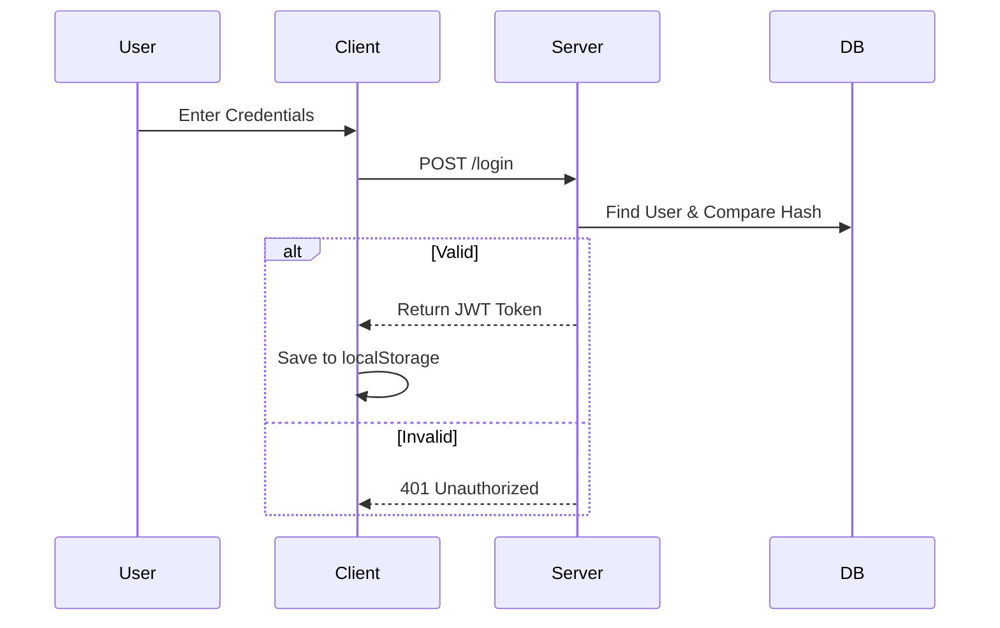
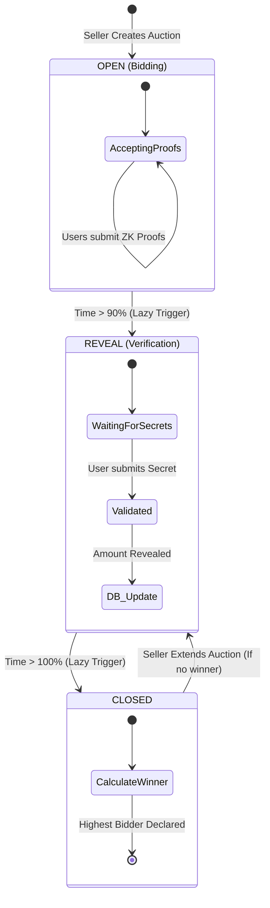
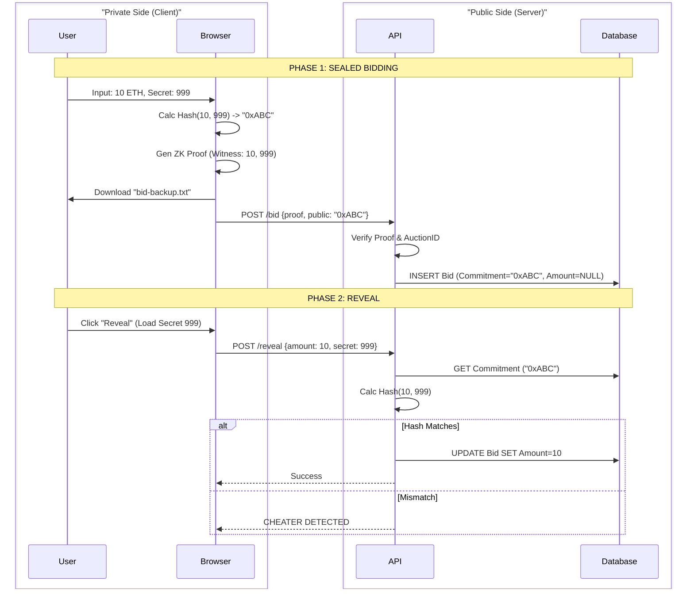

# 🌊 System Flows & Use Cases: Honest Auction House

This document outlines the architectural flows, user journeys, and technical logic of the **Honest Auction House**. It serves as a functional specification for the **Sealed-Bid ZKP Auction System**.

---

## 1. Executive Summary

**Honest Auction House** solves the problem of "Auctioneer Trust" in digital auctions. In standard systems, the database admin can see incoming bids and "front-run" them or leak data.

In this system:

1.  **Bids are encrypted (Hashed)** on the client side.
2.  **Validity is proven** via Zero-Knowledge Proofs (ZKP) without revealing the amount.
3.  **Values are revealed** only after the bidding phase ends.

**Tech Stack:** React (Vite), Node.js (Express), PostgreSQL (Prisma), Circom (ZKP).

---

## 2. Actors & Roles

| Actor             | Role            | Capabilities                                                                     |
| :---------------- | :-------------- | :------------------------------------------------------------------------------- |
| **User (Bidder)** | Participant     | Place sealed bids, download secret backups, reveal bids, view history.           |
| **User (Seller)** | Creator         | Create auctions, view status, extend auctions (if no winner declared).           |
| **Admin**         | System Overseer | View global bid ledger (commitments only), manage users, **reset system state**. |

---

## 3. Core Workflows

### A. Authentication & Session Management

The system uses **JWT (JSON Web Tokens)** for stateless authentication.

- **Register:** User creates account. Password is hashed via `bcrypt`.
- **Login:** Server issues a JWT valid for 24 hours.
- **Persistence:** Token and User Object are stored in `localStorage`.

### B. The Auction Lifecycle (Seller Flow)

The auction logic relies on a **Lazy State Update** mechanism. The server does not run a background cron job; instead, it checks and updates the auction status whenever a user requests the auction list via `GET /auctions`.

**Time Distribution:**

- **Total Duration:** Configured by Seller (default 10 mins).
- **Bidding Phase (OPEN):** First 90% of duration.
- **Reveal Phase (REVEAL):** Last 10% of duration.

### C. The Bidder Flow (Privacy Core)

This is the most critical flow. It is split into two phases to ensure the server never knows the bid amount while the auction is open.

#### Phase 1: The Sealed Bid (Commitment)

**Goal:** Prove valid bid structure without revealing the amount.

1.  **Inputs:** User inputs `Amount` (e.g., 5 ETH) and `Secret` (e.g., 12345).
2.  **Hashing:** Client calculates `Commitment = Poseidon(Amount, Secret, AuctionID)`.
3.  **ZKP Generation:** Client generates a proof that "I know numbers A and S that equal Hash H, and A is positive".
4.  **Verification:** Server checks the proof and the `AuctionID` (to prevent Replay Attacks).
5.  **Persistence:** Server saves the `Commitment`. **Amount remains NULL**.

#### Phase 2: The Reveal

**Goal:** Open the envelope.

1.  **Trigger:** Phase changes to `REVEAL`.
2.  **Restoration:** User loads `Secret` from `localStorage` or backup `.txt` file.
3.  **Submission:** Client sends plain text `{ Amount, Secret }`.
4.  **Validation:** Server calculates `NewHash = Poseidon(Amount, Secret, AuctionID)`.
5.  **Comparison:** If `NewHash == Stored_Commitment`, the bid is valid. The DB is updated.

## 4. Technical Analysis & Security Disclaimers

### Security Features

1.  **Replay Attack Protection:**
    - The ZK Circuit includes `auctionId` as a public input.
    - The hash calculation is `Hash(Amount, Secret, AuctionA)`, which is mathematically distinct from `Hash(Amount, Secret, AuctionB)`.
    - The server explicitly verifies that the `proofAuctionId` matches the target auction before accepting the bid.
2.  **Negative Bid Prevention:**
    - The circuit uses `Num2Bits(64)` to strictly enforce that the `amount` fits within a 64-bit positive integer range.
    - This prevents "Finite Field Wrap-around" attacks where a negative number (e.g., -1) could be interpreted by the circuit as a massive positive number.
3.  **Data Minimization:**
    - The database schema defines `amount` and `secret` as nullable (`Int?` and `String?`).
    - These fields remain strictly empty (`NULL`) until the user voluntarily authorizes the reveal phase.

### Known Limitations & Critical Trade-offs

#### 1. The "Rational Irrationality" of Revealing

- **The Problem:** In a sealed-bid auction, a bidder who realizes they have bid too low (or simply changes their mind) has **no economic incentive** to perform the "Reveal" step. If the highest bidder fails to reveal, the auction might close with no winner or an incorrect price.
- **The Production Solution:** Implement **Bid Collateral**. Users must deposit funds (held in escrow/smart contract) to place a bid. If they submit a commitment but fail to reveal during the specific Reveal Phase, their deposit is **slashed** (confiscated). This aligns economic incentives with protocol compliance.

#### 2. Client-Side Secret Management (XSS Risk)

- **The Problem:** This application stores the "Secret" (random number) in the browser's `localStorage` to allow for a one-click reveal experience. In a production environment, `localStorage` is vulnerable to **Cross-Site Scripting (XSS)** attacks. If malicious JS is injected into the page, it could steal the user's secrets (though it cannot change the commitment already on the server).
- **The Production Solution:** Secrets should be managed via a browser extension (like MetaMask) or encrypted using a key derived from the user's password, ensuring they are never stored in plaintext in the DOM storage.

#### 3. Trusted Setup Centralization

- **The Problem:** The proving keys (`.zkey`) and verification keys were generated locally by the developer. This creates a "Centralization Risk" where the developer _could_ theoretically retain the toxic waste (entropy) and forge fake proofs.
- **The Production Solution:** A **Multi-Party Computation (MPC) Ceremony** (Trusted Setup) is required. This distributes the entropy generation across many participants. As long as at least one participant deletes their toxic waste, the system is mathematically secure.

#### 4. Client-Side Compute (Thick Client)

- Generating ZK proofs in the browser using WASM is CPU intensive. While `snarkjs` is efficient, it may still be slow on older mobile devices.

---

## 5. Suggestions for Improvement

| Feature            | Description                                        | Impact                                                                                          |
| :----------------- | :------------------------------------------------- | :---------------------------------------------------------------------------------------------- |
| **WebSockets**     | Replace `setInterval` polling with `Socket.io`.    | Provides real-time updates and a "Live Auction" feel without aggressive polling.                |
| **Bid Collateral** | Require a deposit to place a bid.                  | Punishes users who refuse to reveal by "slashing" their deposit, solving the incentive problem. |
| **Cron Jobs**      | Use `node-cron` or `BullMQ` for state changes.     | Ensures auctions close exactly on time, regardless of user traffic.                             |
| **MPC Setup**      | Use Multi-Party Computation for the Trusted Setup. | Provides higher trust guarantees for the ZKP keys compared to a single-user setup.              |
